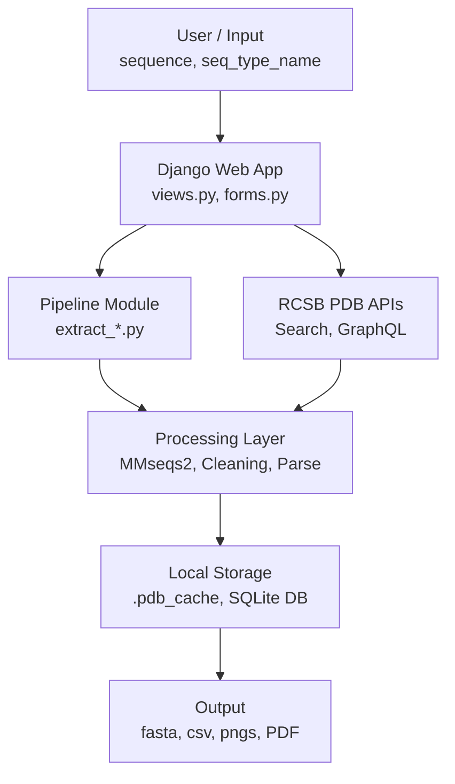

# Protein Crystallization Data Extraction (PCDE)

> This project provides a computational tool designed to automate the "sequence-to-structure" workflow for structural biologists. By taking a single protein sequence as input, the pipeline identifies homologous proteins in the Protein Data Bank (PDB) and extracts historical experimental crystallization conditions such as pH, temperature, and chemical precipitants to guide the design of new crystallization trials.

---

## Table of contents

- [Overview](#overview)
- [How it works](#how-it-works)
- [Project structure](#project-structure)
- [Installation](#installation)
- [Usage](#usage)
  - [Web application](#web-application)
  - [Command-line scripts](#command-line-scripts)
- [Output files](#output-files)
- [Module reference](#module-reference)
- [Dependencies](#dependencies)
- [FAIR principles](#fair-principles)
- [Licence](#licence)

---

## Project Overview
Determining the right conditions to crystallize a protein is one of the most time-consuming challenge in structural biology. The primary goal is to eliminate the manual bottleneck of screening thousands of chemical cocktails by providing a **PDB-assisted shortcut**. This project addresses that challenge by mining the PDB for crystallization conditions used to solve structures of proteins similar to a given query sequence, allowing researchers to skip initial trial-and-error phases and move directly to optimization.

## Key Features

- **Automated Homology Search**  

- **Data Mining**

- **Data Normalization**  

- **Publication-Level Grouping**  
  Prevents "data inflation" by grouping results by **Pubmed ID**, **pH**, **temperature** and **pdbx_details** ensuring that multiple entries from a single study do not bias trends.

- **High-Resolution Visualization**  
  Generates analytical scatter plots and a consolidated PDF report of successful crystallization "cocktails".

 ## 🧬 Workflow Architecture

The pipeline is organized into four main stages, as illustrated in the project’s graphical abstract:

---

### 🔹 Step 1: Sequence Input & PDB Search

- **Input**  
  Accepts a raw protein sequence (plain string or FASTA format).

- **Categorization**  
  The `detect_seq_type` function determines whether the input is **protein, DNA, or RNA**.

- **Search**  
  Sends an automated query to the **RCSB PDB Search API** using identity and e-value thresholds to identify homologous structures solved via **X-ray diffraction**.

---

### 🔹 Step 2: Data Extraction & Filtering

- **Parallel Processing**  
  Utilizes six parallel workers to efficiently handle large-scale data retrieval.

- **Caching**  
  Implements local caching for **mmCIF files** and **PubMed IDs** to improve performance.

- **Extraction Logic**  
  The `extract_mmcif_info` module aggregates key metadata, including:
  - Resolution  
  - Polymer type (`uni_pol` vs. `complex`)  
  - Assembly details (monomer, dimer, etc.)

- **Filtering**  
  The `filter_experimental_conditions` function removes entries missing critical experimental parameters such as **pH, temperature, or method**.

---

### 🔹 Step 3: Chemical Enrichment

- **Compound Mapping**  
  Maps PDB IDs to a specialized `structures.pkl` dataset to extract detailed chemical information.

- **PEG Normalization**  
  The `extract_peg_info()` function standardizes PEG-related data by creating:
  - `PEG_Id` (PEG type)  
  - `PEG_con` (PEG concentration)  

  This resolves inconsistent naming conventions into a machine-readable format.

---

### 🔹 Step 4: Plotting & Reporting

The `run_plot()` stage handles data visualization and output generation:

- **Visual Encoding**  
  - Crystallization methods → unique markers  
  - Alignment scores → `viridis` colormap  

- **Generated Plot**
  - pH vs. PEG concentration (%), including a *"No PEG"* category  

- **Final Report**  
  Produces a color-coded PDF table: {name}_Cryst_cocktail_Table.pdf groups unique conditions by publication and experimental parameters

---

## How it works

```
Query sequence (FASTA or plain string)
        │
        ▼
RCSB MMseqs2 sequence search
(identity cutoff 30 %, X-ray only)
        │
        ▼
Retrieve crystallization metadata
(REST API + mmCIF parsing via gemmi)
        │
        ▼
Filter · merge · standardise
(pandas · compound parsing · PEG extraction)
        │
        ▼
Visualisation
(pH vs Temp scatter · pH vs PEG scatter · PDF cocktail table)
        │
        ▼
Output files
(CSV · FASTA · PNG plots · PDF table)
```

The web application wraps the entire pipeline in a Django interface with Server-Sent Events (SSE) for live progress updates, so the user sees each stage complete in real time without page refresh.

---

## Project structure

# System Architecture


---

## Installation

### Prerequisites

- Python 3.10 or later
- pip

### Steps

```bash
# 1. Clone the repository
git clone https://github.com/your-username/PROTEIN_CRYSTALLIZATION_DATA_EXTRACTION.git
cd PROTEIN_CRYSTALLIZATION_DATA_EXTRACTION

# 2. Create and activate a virtual environment
python -m venv venv
source venv/bin/activate          # Linux / macOS
venv\Scripts\activate             # Windows

# 3. Install dependencies
pip install -r requirements.txt

# 4. Apply database migrations (web app only)
cd protein_crystallization_app
python manage.py migrate

# 5. Start the development server
python manage.py runserver
```

The web application will be available at `http://127.0.0.1:8000`.

---

## Usage

### Web application

1. Open `http://127.0.0.1:8000` in your browser.
2. Enter a descriptive **sequence name** (used to name output files).
3. Paste your **protein sequence** in plain amino acid string format.
4. Click **Run pipeline**.
5. Watch the live progress bar advance through each stage.
6. When complete, download the output files directly from the results panel.

The pipeline runs as a background thread. Progress is pushed to the browser in real time via Server Sent Events, no polling, no page refresh required.

---

### Command-line scripts

#### Single sequence

```bash
cd src
python Main.py
```

Edit the `QUERY_SEQUENCE` variable inside `Main.py` before running.

---

#### FASTA file input — per-sequence CSV

```bash
cd src_fasta_file
python main.py input.fasta
```

Produces one CSV file per sequence in the FASTA file. Each CSV contains the PDB ID, similarity score, and experimental crystallization data for all homologous structures found.

---

#### FASTA file input — combined CSV (no duplicates)

```bash
cd src_fasta_file
python main2.py input.fasta
```

Produces a single combined CSV file for all sequences in the FASTA file. PDB entries that appear as hits for multiple sequences are included only once, making this output suitable for batch analysis across a protein family.

---

## Output files

| File | Format | Description |
|---|---|---|
| `{name}_sequence.fasta` | FASTA | Input sequence saved in standard format |
| `{name}_rcsb_hits.csv` | CSV | MMseqs2 search results: PDB ID, entity, score, identity (%), E-value, query region, alignment |
| `{name}_merged_results.csv` | CSV | Full merged dataset: crystallization conditions + sequence similarity scores |
| `{name}_PEG.png` | PNG | Scatter plot: pH vs PEG concentration (%), coloured by similarity score |
| `{name}_Cryst_cocktail_Table.pdf` | PDF | Coloured summary table of all unique crystallization conditions |

### Merged CSV columns

| Column | Description |
|---|---|
| `PDB_ID` | PDB accession code |
| `Entity` | Entity number within the PDB entry |
| `Score` | RCSB MMseqs2 similarity score (0–1) |
| `Seq_id` | Sequence identity (%) |
| `E-value` | Statistical significance of the alignment |
| `Resolution` | Diffraction resolution (Å) |
| `Pubmed_id` | PubMed identifier of the associated publication |
| `Method` | Crystallization method (e.g. sitting drop vapour diffusion) |
| `pH` | Crystallization pH |
| `Temp` | Crystallization temperature (K) |
| `Ligands` | Co-crystallized ligands, cofactors, or inhibitors |
| `Polymer` | Polymer type (protein, RNA, DNA, complex) |
| `Assembly` | Biological assembly (monomer, dimer, etc.) |
| `pdbx_pH_range` | pH range when a single value is not reported |
| `pdbx_details` | Free-text crystallization details (REMARK 280 equivalent) |
| `Compounds(con_unit=mM)` | Parsed compound list with concentrations in mM |
| `PEG_Id` | PEG molecular weight identifier (e.g. 4000) |
| `PEG_con` | PEG concentration (%) |

---

## Module reference

### `rcsb_sequence_identity.py`

Performs a sequence similarity search against the RCSB PDB using the MMseqs2-based Search API. Filters results to X-ray diffraction structures only. Returns PDB ID, entity, similarity score, sequence identity, and E-value for each hit.

**Key function:** `run_and_save(sequence, output_csv_1)`

---

### `PDB_searchAPI.py`

This module is the primary data collection engine of the pipeline. It queries the RCSB PDB for structures similar to a query sequence, downloads their experimental metadata, and saves the results to a CSV file.

**Sequence search.** `search_pdb_by_sequence()` submits a combined query to the RCSB Search API: a sequence similarity search (MMseqs2, identity cutoff 50 %, E-value ≤ 1×10⁻⁵) intersected with an X-ray diffraction filter, so only crystallographically determined structures are returned. Results are ranked by score and filtered against a configurable score cutoff.

**Parallel metadata extraction.** For each hit, `extract_mmcif_info()` is called concurrently across a thread pool. It downloads and caches the mmCIF file for the entry, then extracts: resolution, PubMed ID, polymer type (single chain vs complex), biological assembly, crystallization method, pH, temperature, free-text crystallization details (`pdbx_details`), pH range, and ligands.

**Two-tier field extraction.** Four dedicated functions — `get_ph_from_mmcif_or_details()`, `get_method_from_mmcif_or_details()`, `get_temperature_from_mmcif_or_details()`, and `get_pdbx_ph_range_from_mmcif_or_details()` — each attempt to read the value from the structured mmCIF field first, and fall back to regular expression mining of the free-text `pdbx_details` string if the structured field is absent or empty.

**Caching.** Downloaded mmCIF files and PubMed ID lookups are cached to a local `.pdb_cache/` directory so repeated runs do not re-download data already on disk.

**Filtering.** `filter_experimental_conditions()` post-processes the output CSV to retain only rows that have at least one of pH, temperature, method, or pdbx_details populated — discarding entries with no usable crystallization information.

**Key functions:**
- `search_pdb_by_sequence(sequence, output_csv, max_workers)`
- `filter_experimental_conditions(input_csv, output_csv)`

---

### `extract_structures.py`

 Lynch et al. developed a Python-based tool in 2020 for creating a searchable and updatable database of crystallization conditions extracted from the free-text crystallization details available in PDB entries. The database includes a parsing method that converts crystallization descriptions into structured lists of chemical compounds and their concentrations, along with a dictionary for standardizing compound names. The tool is freely available through the [GitHub repository](https://github.com/maxdudek/crystallizationDatabase). An updated version of the database was generated for this study by executing the standalone `pdb_crystal_database.py` script located in the `src` subdirectory. The workflow was designed to parse the inconsistently formatted crystallization details associated with PDB structures solved using the X-ray diffraction (XRD) method into a standardized list of compounds suitable for computational analysis. In addition, the pipeline was executed using a newer version of Natural Language Toolkit (NLTK) with the `tokenizers/punkt_tab` tokenizer, enabling the successful extraction of crystallization data from 195,183 structures.
  The database stored in the `structures.pkl` file of the `structures` sub-folder. The database can be updated as the PDB keep on growing in number of structures. 

  The extract_structure.py script matches entries using PDB identifiers and appends standardized compound and concentration information from the structures.pkl database to the filtered CSV dataset. In addition, the workflow automatically extracts PEG-related information, including PEG molecular weight identifiers and concentrations, through regular-expression-based parsing. The final processed dataset is exported as a CSV file containing structured crystallization conditions suitable for downstream computational and statistical analysis.

Appends compound and PEG data from a pre-built compound library (`structures.pkl`) to the filtered crystallization CSV. Uses a fake module injection pattern to safely unpickle `Structure` objects without requiring the original package.

**Key functions:**
- `format_compounds(compound_list)` — converts flat alternating list to `"Compound (concentration)"` string
- `extract_peg_info(compound_str)` — extracts PEG molecular weight and numeric concentration
- `append_compound_to_filtered_csv(structures_file, filtered_csv, output_csv)`

---
### `plot.py`

Generates all visualisation outputs from the merged CSV. Handles missing pH and temperature values using sentinel coordinates, assigns method-specific marker shapes, and colours data points by similarity score using the viridis colormap.

**Key function:** `run_plot(output_csv_file, protein_name)`

**Outputs:**
- `{name}_TEMP.png` — pH vs temperature scatter plot
- `{name}_PEG.png` — pH vs PEG concentration scatter plot
- `{name}_Cryst_cocktail_Table.pdf` — coloured condition summary table

---

### `utils.py`

Orchestrates the full pipeline as a single callable function. Accepts a `progress_queue` for real-time SSE updates and a `job_id` for database tracking. Manages all temporary files and cleans up after each stage.

**Key function:** `run_pipeline(sequence, seq_type_name, base_output_dir, job_id, progress_queue)`

---

### `views.py`

Handles HTTP requests for the Django web application. Uses an in-memory queue registry (`_progress_queues`) to push pipeline progress events to the browser via Server-Sent Events, eliminating database polling lag.

**Views:**
- `run_pipeline_view` — renders the form and starts the background pipeline thread
- `progress_stream` — SSE endpoint that streams live progress events
- `submission_status` — polling fallback returning JSON progress
- `results_api` — returns file paths for completed outputs

---

### `src_fasta_file/cleaning_and_read_fasta_file.py`

Reads a raw FASTA file containing one or more sequences, removes gap characters (`-`), and returns a dictionary mapping sequence IDs to cleaned sequences.

---

### `src_fasta_file/extract_data_fasta.py`

Performs a PDB sequence search for each sequence in a cleaned FASTA dictionary. Parses the resulting mmCIF files using `gemmi` to extract experimental crystallization details. The identity cutoff is set to 30 % to maximise the number of retrieved structures.

**Key function:** `extract_crystallization(pdb_id)` — pulls all crystallization fields from the mmCIF block via `doc.sole_block()`

---

## Dependencies

| Package | Purpose |
|---|---|
| `django` | Web application framework |
| `requests` | HTTP calls to RCSB APIs |
| `pandas` | Data manipulation and CSV handling |
| `gemmi` | mmCIF file parsing |
| `matplotlib` | Scatter plots and PDF table generation |
| `numpy` | Numerical operations |
| `tabulate` | Terminal table formatting |

Install all dependencies with:

```bash
pip install -r requirements.txt
```

---

---

## Licence

This project is released under the terms of the licence included in the `MIT LICENCE` file.

---

## Citation

If you use this tool in your research, please cite the associated thesis and the Protein Data Bank:

> Berman H.M. et al. (2000) The Protein Data Bank. *Nucleic Acids Research* **28**: 235–242.
> M. L. Lynch, M. F. Dudek, and S. E. Bowman (2020) A searchable database of crystallization cocktails in the pdb: analyzing the chemical condition
space. *Patterns 1* no. **4**,  
       
