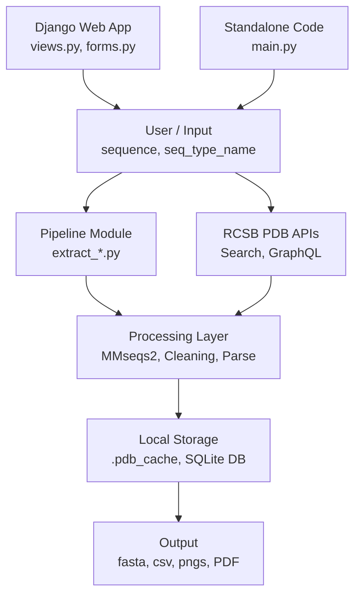

# Protein Crystallization Data Extraction (PCDE)

> This project provides a computational tool designed to automate the "sequence-to-structure" workflow for structural biologists. By taking a single protein sequence as input, the pipeline identifies homologous structures in the RCSB Protein Data Bank, extracts crystallization conditions, and generates publication-ready visualizations.

---

## Table of Contents

- [Overview](#overview)
- [Key Features](#key-features)
- [How it works](#how-it-works)
- [Workflow Architecture](#-workflow-architecture)
- [Installation](#installation)
- [Usage](#usage)
  - [Web application](#web-application)
  - [Command-line scripts](#command-line-scripts)
- [Output files](#output-files)
- [Module reference](#module-reference)
- [Dependencies](#dependencies)
- [Releases & Downloads](#releases--downloads)
- [Citation](#citation)
- [Licence](#licence)

---

## Repository Contents

### `Input/`

The scripts import lists and dictionaries from files in **json** format using the json Python module. The description of the **json** files in this directory are described [here](https://github.com/RitAreaSciencePark/Protein_Crystallization_Data_Extraction/tree/main/Input).

### `src/`

This directory contains all the python codes for the general pipeline handling a single sequence as input.

### `src_fasta_file/`

This directory contains the codes that handle multi sequences fasta file.

### `Structures/`

This directory contains **structure.pkl** file which is the pdb database with the list of compound extracted from the **pdbx_details** at the level of the **exptl_crystal_grow** section of the mmCIF format.

### `Protein_crystalization_app/`

This directory contains the code and all the elements used to design the django web application.

--- 
## Project Overview

Determining the right conditions to crystallize a protein is one of the most time-consuming challenge in structural biology. The primary goal is to eliminate the manual bottleneck of screening thousands of crystallization conditions. PCDE automates this workflow by:

1. **Mining the PDB:** Sequence similarity search against RCSB structures
2. **Extracting metadata:** Parallel retrieval of experimental crystallization conditions
3. **Enriching data:** Compound normalization and PEG concentration parsing
4. **Visualizing results:** Publication-quality scatter plots and PDF tables

---

## Key features

### Automated sequence-based PDB mining
The pipeline accepts any protein, DNA, or RNA sequence and automatically queries the RCSB PDB using the MMseqs2 sequence similarity engine. It filters results to X-ray diffraction structures only, ensuring data quality and relevance.

### Two-tier metadata extraction
Every crystallization parameter is extracted using a two-tier strategy: the structured mmCIF field is read first, and if absent or empty, regular expression mining is applied to the free-text `pdbx_details` field to capture manually curated conditions.

### Intelligent free-text parsing
The `pdbx_details` field is parsed using a multi-step natural language processing pipeline adapted from the crystallization database of Dudek et al. It handles PEG/MPEG name normalisation, concentration standardization, and chemical synonym recognition.

### Parallel data collection
Metadata extraction uses a configurable multi-threaded `ThreadPoolExecutor`, processing multiple PDB entries simultaneously. A live progress bar (tqdm) updates in real time as each entry completes, providing instant feedback to the user.

### FAIR-compliant data provenance
Every row in the output dataset is traceable to its source through the PDB accession code, PubMed ID, and experimental method. All data originates from the publicly accessible RCSB REST and GraphQL APIs.

### Interactive web application
A Django-based web application wraps the full pipeline in a browser interface. All output files are available for inline viewing and direct download when the pipeline completes.

### High-Resolution Visualization
Two scatter plots are generated automatically: pH versus temperature and pH versus PEG concentration with data points coloured by sequence similarity score using the viridis colormap and shaped by crystallization method for instant visual interpretation.

## 🧬 Workflow Architecture

The pipeline is organized into four main stages, as illustrated in the project's graphical abstract:

### 🔹 Step 1: Sequence Input & PDB Search

- **Input**  
  Accepts a raw protein sequence (plain string or FASTA format).

- **Categorization**  
  The `detect_seq_type` function determines whether the input is **protein, DNA, or RNA**.

- **Search**  
  Sends an automated query to the **RCSB PDB Search API** using identity and e-value thresholds to identify homologous structures solved via **X-ray diffraction**.

---

### 🔹 Step 2: Data Extraction & Filtering

- **Parallel Processing**  
  Utilizes six parallel workers to efficiently handle large-scale data retrieval.

- **Caching**  
  Implements local caching for **mmCIF files** and **PubMed IDs** to improve performance on repeated runs.

- **Extraction Logic**  
  The `extract_mmcif_info` module aggregates key metadata, including:
  - Resolution  
  - Polymer type (`uni_pol` vs. `complex`)  
  - Assembly details (monomer, dimer, etc.)

- **Filtering**  
  The `filter_experimental_conditions` function removes entries missing critical experimental parameters: **pH, temperature, method and pdbx_details**.

---

### 🔹 Step 3: Chemical Enrichment and Normalization

- **Compound Mapping**  
  Maps PDB IDs to a specialized dictionary (structures.pkl) and extracts the list of compounds to enrich the csv file. From the list of compounds, PEG_ID and the PEG_concentration are extracted and standardized.

- **Publication Grouping**  
  PDB IDs having the same crystallization conditions (PubMed ID, pH, temperatures and compounds) are grouped in one line to eliminate redundancy.

---

### 🔹 Step 4: Plotting & Reporting

The `run_plot()` stage handles data visualization and output generation:

- **Visual Encoding**  
  - Crystallization methods → unique markers  
  - Alignment scores → `viridis` colormap  

- **Generated Plots**
  - pH vs. PEG concentration (%), including *"No PEG"* and *"No pH"* categories
  - pH vs. Temperature (K) for thermal trend analysis

- **Final Report**  
  Produces a color-coded PDF table: `{name}_Cryst_cocktail_Table.pdf` that groups unique conditions by publication and experimental parameters for easy reference.

---

## How it works

```
Query sequence (FASTA or plain string)
        │
        ▼
RCSB MMseqs2 sequence search
(identity cutoff 30 %, X-ray only)
        │
        ▼
Retrieve crystallization metadata
(REST API + mmCIF parsing via gemmi)
        │
        ▼
Filter · merge · standardize
(pandas · compound parsing · PEG extraction)
        │
        ▼
Visualization
(pH vs PEG scatter · PDF cocktail table)
        │
        ▼
Output files
(CSV · FASTA · PNG plots · PDF table)
```

The web application wraps the entire pipeline in a Django interface with Server-Sent Events (SSE) for live progress updates, so the user sees each stage complete in real time without page refresh.

---

## Project Architecture


```mermaid
flowchart TD

    A[Django Web App<br>views.py, forms.py]

    H[Standalone Code<br>main.py]

    B[User / Input<br>sequence, seq_type_name]

    C[Pipeline Module<br>extract_*.py]

    D[RCSB PDB APIs<br>Search, GraphQL]

    E[Processing Layer<br>MMseqs2, Cleaning, Parse]

    F[Local Storage<br>.pdb_cache, SQLite DB]

    G[Output<br>fasta, csv, pngs, PDF]

    A --> B
    H --> B
    B --> C
    B --> D

    C --> E
    D --> E

    E --> F

    F --> G
```
---

## Installation

### Prerequisites

- Python 3.10 or later
- pip

### Steps

```bash
# 1. Clone the repository
git clone https://github.com/RitAreaSciencePark/Protein_Crystallization_Data_Extraction.git
cd Protein_Crystallization_Data_Extraction

# 2. Create and activate a virtual environment
python -m venv venv
source venv/bin/activate          # Linux / macOS
venv\Scripts\activate             # Windows

# 3. Install dependencies
pip install -r requirements.txt

# 4. Apply database migrations (web app only)
cd protein_crystallization_app
python manage.py migrate

# 5. Start the development server
python manage.py runserver
```

The web application will be available at `http://127.0.0.1:8000`.

---

## Usage

### Web application

1. Open `http://127.0.0.1:8000` in your browser.
2. Enter a descriptive **sequence name** (used to name output files).
3. Paste your **protein sequence** in plain amino acid string format.
4. Click **Run pipeline**.
5. When complete, download the output files directly from the results panel.

The pipeline runs as a background thread. Progress is pushed to the browser in real time via Server Sent Events, no polling, no page refresh required.

---

### Command-line for standalone pipeline scripts

#### Single sequence

```bash
cd src
python Main.py
Enter sequence: MSPRKTYILKLYVAGNTPNSVRALK...
Enter a descriptive sequence type name: KaiB
```
---

#### FASTA file input 

```bash
cd src_fasta_file
python main.py "NAME_OF_THE_FASTA_FILE".fasta
```
Produces one CSV file per sequence in the FASTA file. Each CSV contains the PDB ID, similarity score, and experimental crystallization data for all homologous structures found.

---

#### FASTA file input — combined CSV (no duplicates)

```bash
cd src_fasta_file
python main2.py "NAME_OF_THE_FASTA_FILE".fasta
```
Produces a single combined CSV file for all sequences in the FASTA file. PDB entries that appear as hits for multiple sequences are included only once, making this output suitable for batch analysis.

---

## Output files

| File | Format | Description |
|---|---|---|
| `{name}_sequence.fasta` | FASTA | Input sequence saved in standard format |
| `{name}_rcsb_hits.csv` | CSV | MMseqs2 search results: PDB ID, entity, score, identity (%), E-value|
| `{name}_merged_results.csv` | CSV | Full merged dataset: crystallization conditions + sequence similarity scores |
| `{name}_PEG.png` | PNG | Scatter plot: pH vs PEG concentration (%), coloured by similarity score |
| `{name}_TEMP.png` | PNG | Scatter plot: pH vs Temperature (K), coloured by similarity score |
| `{name}_Cryst_cocktail_Table.pdf` | PDF | Coloured summary table of all unique crystallization conditions |

### Merged CSV columns

| Column | Description |
|---|---|
| `PDB_ID`| The unique 4-character PDB accession code |
| `Entity` | Entity number within the PDB entry |
| `Score` | RCSB MMseqs2 similarity score (0–1) |
| `Seq_id` | Sequence identity (%) |
| `E-value` | Statistical significance of the alignment |
| `Resolution` | Diffraction resolution (Å) |
| `Pubmed_id` | PubMed identifier of the associated publication |
| `Method` | Crystallization method (e.g. sitting drop vapour diffusion) |
| `pH` | Crystallization pH |
| `Temp` | Crystallization temperature (K) |
| `Ligands` | Co-crystallized ligands, cofactors, or inhibitors |
| `Polymer` | uni_pol (single polymer) or complex (multiple chains) |
| `Assembly` | Oligomeric state from _pdbx_struct_assembly (monomer, dimer, etc.) |
| `pdbx_pH_range` | pH range when a single value is not reported |
| `pdbx_details` | Free-text crystallization details (REMARK 280 equivalent) |
| `Compounds(con_unit=mM)` | Parsed compound list with concentrations in mM |
| `PEG_Id` | PEG molecular weight identifier (e.g. 4000) |
| `PEG_con` | PEG concentration (%) |

---

## Module reference

### `rcsb_sequence_identity.py`

Performs a sequence similarity search against the RCSB PDB using the MMseqs2-based Search API. Filters results to X-ray diffraction structures only. Returns PDB ID, entity, similarity score, sequence identity (%), and E-value for each hit.

**Key function:** `run_and_save(sequence, output_csv_1)`

---

### `PDB_searchAPI.py`

This module is the primary data collection engine of the pipeline. It queries the RCSB PDB for structures similar to a query sequence, downloads their experimental metadata, and saves the results to CSV.

**Sequence search.** `search_pdb_by_sequence()` submits a combined query to the RCSB Search API: a sequence similarity search (MMseqs2, identity cutoff 50 %, E-value ≤ 1×10⁻⁵) intersected with X-ray crystallography only.

**Parallel metadata extraction.** For each hit, `extract_mmcif_info()` is called concurrently across a thread pool. It downloads and caches the mmCIF file for the entry, then extracts: resolution, polymer type, and assembly information.

**Two-tier field extraction.** Four dedicated functions — `get_ph_from_mmcif_or_details()`, `get_method_from_mmcif_or_details()`, `get_temperature_from_mmcif_or_details()`, and `get_pdbx_ph_range_from_mmcif_or_details()` — implement the two-tier extraction strategy.

**Caching.** Downloaded mmCIF files and PubMed ID lookups are cached to a local `.pdb_cache/` directory so repeated runs do not re-download data already on disk.

**Filtering.** `filter_experimental_conditions()` post-processes the output CSV to retain only rows that have at least one of pH, temperature, method, or pdbx_details populated — discarding entries with incomplete metadata.

**Key functions:**
- `search_pdb_by_sequence(sequence, output_csv, max_workers)`
- `filter_experimental_conditions(input_csv, output_csv)`

---

### `extract_structures.py`

Lynch et al. developed a Python-based tool in 2020 for creating a searchable and updatable database of crystallization conditions extracted from the free-text crystallization details available in the PDB. The database is stored in the `structures.pkl` file of the `structures` sub-folder and can be updated as the PDB grows.

The extract_structures.py script matches entries using PDB identifiers and appends standardized compound and concentration information from the structures.pkl database to the filtered CSV dataset.

Appends compound and PEG data from a pre-built compound library (`structures.pkl`) to the filtered crystallization CSV. Uses a safe unpickling pattern to restore `Structure` objects.

**Key functions:**
- `format_compounds(compound_list)` — converts flat alternating list to `"Compound (concentration)"` string
- `extract_peg_info(compound_str)` — extracts PEG molecular weight and numeric concentration
- `append_compound_to_filtered_csv(structures_file, filtered_csv, output_csv)`

---

### `plot.py`

Generates all visualisation outputs from the merged CSV. Handles missing pH and temperature values using sentinel coordinates, assigns method-specific marker shapes, and colours data points by sequence similarity using the viridis colormap.

**Key function:** `run_plot(output_csv_file, protein_name)`

**Outputs:**
- `{name}_TEMP.png` — pH vs temperature scatter plot (300 dpi)
- `{name}_PEG.png` — pH vs PEG concentration scatter plot (300 dpi)
- `{name}_Cryst_cocktail_Table.pdf` — coloured condition summary table

---

### `src_fasta_file/cleaning_and_read_fasta_file.py`

Reads a raw FASTA file containing one or more sequences, removes gap characters (`-`), and returns a dictionary mapping sequence IDs to cleaned sequences.

---

### `src_fasta_file/extract_data_fasta.py`

Performs a PDB sequence search for each sequence in a cleaned FASTA dictionary. Parses the resulting mmCIF files using `gemmi` to extract experimental crystallization details. The identity cutoff is configurable.

**Key function:** `extract_crystallization(pdb_id)` — pulls all crystallization fields from the mmCIF block via `doc.sole_block()`

---

### For Web Application

#### `utils.py`

Orchestrates the full pipeline as a single callable function. Accepts a `progress_queue` for real-time SSE updates and a `job_id` for database tracking. Manages all temporary files and cleans up after completion.

**Key function:** `run_pipeline(sequence, seq_type_name, base_output_dir, job_id, progress_queue)`

---

#### `views.py`

Handles HTTP requests for the Django web application. Uses an in-memory queue registry (`_progress_queues`) to push pipeline progress events to the browser via Server-Sent Events, eliminating the need for polling.

**Views:**
- `run_pipeline_view` — renders the form and starts the background pipeline thread
- `progress_stream` — SSE endpoint that streams live progress events
- `submission_status` — polling fallback returning JSON progress
- `results_api` — returns file paths for completed outputs

---

## Dependencies

| Package | Purpose |
|---|---|
| `django` | Web application framework |
| `requests` | HTTP calls to RCSB APIs |
| `pandas` | Data manipulation and CSV handling |
| `gemmi` | mmCIF file parsing |
| `matplotlib` | Scatter plots and PDF table generation |
| `numpy` | Numerical operations |
| `tabulate` | Terminal table formatting |
| `pdf2image` | Display PDF files in the web application |
| `tqdm` | Progress bar for CLI |
| `concurrent.futures` | Parallel metadata extraction |

Install all dependencies with:

```bash
pip install -r requirements.txt
```

---

## Releases & Downloads

### Current Release: v1.0.0

The first stable release of PCDE is now available! Download pre-built archives:

| Format | Download | Description |
|--------|----------|-------------|
| ZIP | [V1.0.0.zip](https://github.com/RitAreaSciencePark/Protein_Crystallization_Data_Extraction/archive/refs/tags/V1.0.0.zip) | Complete repository as ZIP archive |
| TAR.GZ | [V1.0.0.tar.gz](https://github.com/RitAreaSciencePark/Protein_Crystallization_Data_Extraction/archive/refs/tags/V1.0.0.tar.gz) | Complete repository as compressed TAR archive |

**View the [full release notes](RELEASE_NOTES_v1.0.0.md) for v1.0.0**

#### Quick Install from ZIP

```bash
unzip V1.0.0.zip
cd Protein_Crystallization_Data_Extraction
python -m venv venv
source venv/bin/activate  # or venv\Scripts\activate on Windows
pip install -r requirements.txt
```

**[See all releases](https://github.com/RitAreaSciencePark/Protein_Crystallization_Data_Extraction/releases)**

---

## Citation

If you use this tool in your research, please cite:

> R. N. NANA, Valerio PIOMPONI, and Adrea DALLE VEDOVE (2026). "Data Extraction Tool for Protein Crystallization Conditions". GitHub Repository. https://github.com/RitAreaSciencePark/Protein_Crystallization_Data_Extraction

Or use the [`CITATION.cff`](CITATION.cff) file included in this repository for automatic citation management.

For the original crystallization database methodology, also cite:

> M. L. Lynch, M. F. Dudek, and S. E. Bowman (2020). A searchable database of crystallization cocktails in the pdb: analyzing the chemical condition space. *Patterns* 1(4).

---

## Licence

This project is released under the MIT License. See the [`LICENSE`](LICENSE) file for full details.

```
Copyright (c) 2025 RitAreaSciencePark

Permission is hereby granted, free of charge, to any person obtaining a copy
of this software and associated documentation files (the "Software"), to deal
in the Software without restriction, including without limitation the rights
to use, copy, modify, merge, publish, distribute, sublicense, and/or sell
copies of the Software, and to permit persons to whom the Software is
furnished to do so, subject to the following conditions:

The above copyright notice and this permission notice shall be included in all
copies or substantial portions of the Software.
```

---

## Support & Contributing

For issues, feature requests, or questions:
- 📝 [Open an Issue](https://github.com/RitAreaSciencePark/Protein_Crystallization_Data_Extraction/issues)
- 💬 [Start a Discussion](https://github.com/RitAreaSciencePark/Protein_Crystallization_Data_Extraction/discussions)

We welcome contributions! Please see [CONTRIBUTING.md](CONTRIBUTING.md) for guidelines.

---

**Thank you for using PCDE! 🧬**
