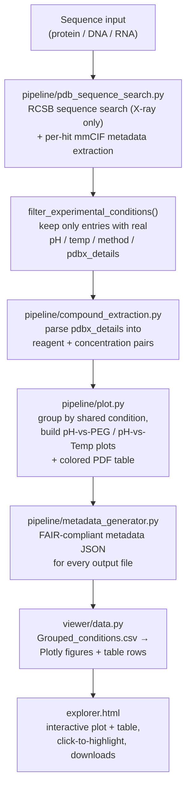

# Crystal Explorer

A Django app that runs the full crystallization-condition pipeline
straight from a web form:

1. **You type/paste** a protein name and a sequence (raw or FASTA) into
   the form.
2. The app runs, server-side, in one request:
   - `pipeline/pdb_sequence_search.py` -- searches RCSB PDB (X-ray only)
     for sequence homologs and pulls crystallization metadata.
   - `pipeline/compound_extraction.py` -- extracts compounds/concentrations
     from `pdbx_details`.
   - `pipeline/plot.py` -- builds the pH-vs-Temperature and pH-vs-PEG
     plots, a colored PDF summary table, and `Grouped_conditions.csv`.
   - `pipeline/metadata_generator.py` -- writes a FAIR-compliant metadata
     JSON describing every output file.
3. You're redirected to a results page: an **interactive** Plotly version
   of the pH-vs-PEG plot next to the full table -- click a point and it
   scrolls to and highlights the matching table row. Static PDF/PNG
   versions are available to download alongside it.

Each protein's run gets its own folder under `pipeline_outputs/<name>/`,
so you can search a new protein or come back to `/protein/<name>/` for
one you already ran.

## Setup

```bash
pip install -r requirements.txt
python manage.py migrate
python manage.py runserver
```

Then open http://127.0.0.1:8000/, fill in the form, and hit **Run search**.

To use the LLM fallback for compound extraction (resolves reagents the
built-in dictionary doesn't recognize, and learns them for next time),
set `ANTHROPIC_API_KEY` in the environment before starting the server,
and check the "Use Claude..." box in the form.

## Notes on running the search synchronously

The search view runs stage 1-4 of the pipeline **inside the HTTP
request** -- simplest to set up, but it means the browser tab waits
for the whole thing (RCSB search + per-hit mmCIF fetches + plotting) to
finish before the results page loads. The form defaults `max_hits` to 25
to keep this reasonable. For heavier use (many hits, many users), moving
this to a background task (Celery, Django-Q, etc.) that the results page
polls for would be the next step -- ask if you want that built out.

## Pipeline



## Project layout

```mermaid
flowchart TB
    subgraph CE["crystal_explorer/"]
        direction LR
        manage["manage.py"]
        reqs["requirements.txt"]
        dbfile["db.sqlite3"]
    end

    subgraph CFG["config/  —  Django settings"]
        direction LR
        settings["settings.py"]
        urlsconf["urls.py"]
        wsgi["asgi.py · wsgi.py"]
    end

    subgraph PIPE["pipeline/  —  4-stage pipeline package"]
        direction TB
        s1["1 · pdb_sequence_search.py — RCSB search + mmCIF metadata"]
        s2["2 · compound_extraction.py — reagent/compound parsing"]
        s3["3 · plot.py — grouping, plots, PDF table"]
        s4["4 · metadata_generator.py — FAIR metadata JSON"]
        cache[".pdb_cache/ — cached mmCIF + PubMed lookups"]
    end

    subgraph VIEW["viewer/  —  Django app (the web UI)"]
        direction TB
        models["models.py — SearchRun"]
        forms["forms.py — SequenceSearchForm"]
        views["views.py — index / results / history / download"]
        data["data.py — CSV to Plotly + table rows"]
        migr["migrations/"]
        static["static/viewer/ — logo, background"]
        subgraph TPL["templates/viewer/"]
            direction LR
            base["base.html"]
            home["home.html"]
            expl["explorer.html"]
            hist["history.html"]
            org["Organization.html"]
        end
    end

    subgraph OUT["pipeline_outputs/  —  created at runtime"]
        direction TB
        run["&lt;protein&gt;_&lt;timestamp&gt;/"]
        files["fasta · Output.csv · Output_compounds.csv<br/>Grouped_conditions.csv · PDF · PNG · metadata.json"]
        run --- files
    end
```



## Features

### Home
- Landing page introducing the tool -- no forms or backend interaction.
- "Mission" panel: 3-step explainer (Search & parse → Visualize & export → Revisit anytime).
- "Launch Explorer →" button linking to the search page.
- "How it works" panel: 3-card overview (Search / Extract / Visualize).

### Explorer
**Search form**
- Protein name (required text field, used to name the output folder/files).
- Sequence field accepting raw text or a full FASTA record (header lines and blank lines stripped automatically).
- Sequence type selector -- Protein / DNA / RNA.
- Minimum identity (0-1) and max E-value thresholds.
- Max PDB entries to fetch (default 25, capped at 200 -- kept modest since the search runs synchronously).
- Optional "Use Claude to resolve compounds the dictionary misses" checkbox (needs `ANTHROPIC_API_KEY` on the server).
- Inline field validation errors; submit button disables and shows a "Running…" note while the pipeline executes.
- Smart re-run handling: an identical search redirects straight to its existing results with no re-run; the same protein/sequence with different thresholds reuses and overwrites that same run instead of piling up duplicates in History.
- Friendly error messages on failure (e.g. a plain-language "bad sequence format" message instead of a raw HTTP error).

**Results**
- Two interactive Plotly plots: pH vs. PEG concentration, and pH vs. Temperature -- colored by search score, shaped by crystallization method, with a shared legend.
- Click a point on either plot to scroll to and highlight its row in the table below.
- Conditions table with one row per unique crystallization condition:
  - PDB ID(s) linking out to RCSB, UniProt accession(s) linking out to UniProt (the accession matching your query sequence is bolded; a complex's differing accessions per merged PDB ID are color-coded to show which belongs to which).
  - PubMed ID linking to the publication.
  - Each extracted compound linking to its PubChem page, with concentration shown alongside.
  - "3D View" button(s) that load the structure into an in-page Mol* viewer without leaving the page (still openable in a new tab via middle-click).
- "No hits found" message (with a suggestion to loosen thresholds) shown when a search matches nothing, instead of an empty table.
- Static export downloads (only shown if generated): input FASTA, compounds CSV, PDF summary table, PEG/temperature plots (PNG), and a FAIR-compliant metadata JSON.

### History
- Paginated list (25 per page) of every past search, newest first.
- Per-run: protein name + sequence preview, sequence type, search parameters (identity/E-value/max hits/Claude fallback), status pill (Completed/Failed/Running -- failed runs show their error message), matched-condition count, submission time, and runtime.
- "View results" link for completed runs.
- Delete button (with a confirmation prompt) that removes both the history entry and its output files from disk.
- Empty state with a link back to Explorer when no searches exist yet.

### Organization
 AREA Science Park 